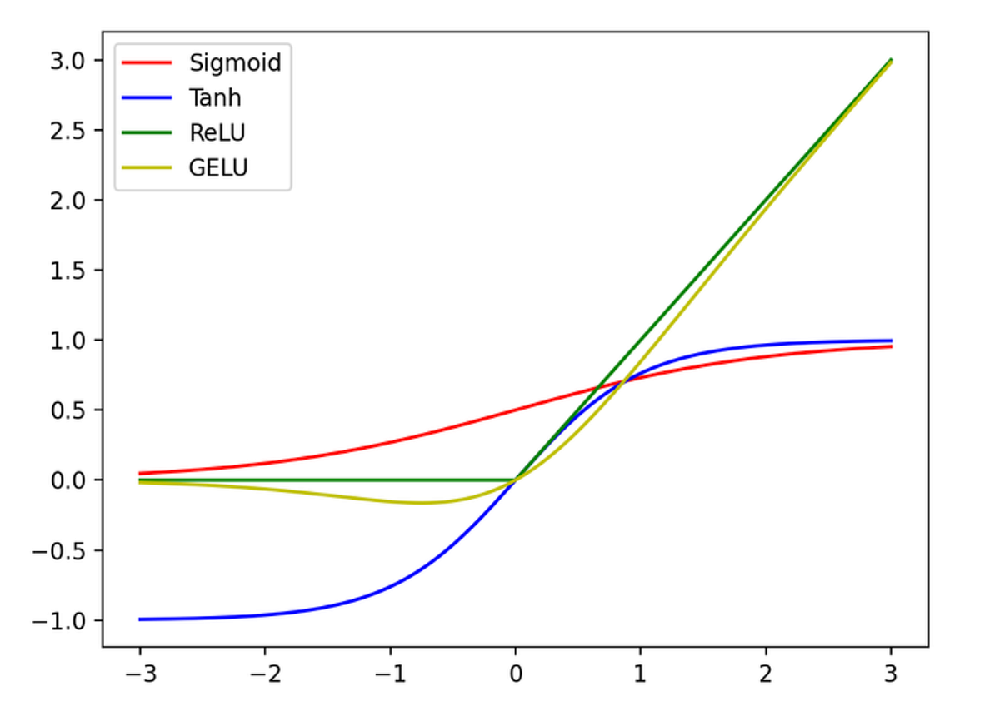

# What is a Feed Forward Network?
**Definition**: An artificial neural network in which information flows in a single direction

## The math behind it
A feedforward neural network can use many different activation functions, including (but not limited to):

#### Tanh: 
Hyperbolic tangent. Keeps values between ±1, centering them around 0. This usually makes it easier for the model to learn.
$${y(v_i) = \tanh(v_i)}$$

#### Sigmoid:
A function that is in an "S" shape, containing values between 0 and 1. For very negative inputs, it approaches 0, for very positive inputs, it approaches 1, and if the input is 0, it outputs 0.5.
$$S(x) = \frac{1}{(1+e^x)}$$

#### ReLU:
Rectified linear unit. If *x* is positive, *f(x) = x*. Otherwise, *f(x) = 0*
$$f(x) = max(0, x)$$

#### GELU:
Basically smooth ReLU. Meaning that it can differentiate easier due to its shape and smoothness.
$$ \text{GELU}(x) = 0.5x(1 + \tanh(\sqrt\frac{2}{\pi} \cdot (x + 0.044715x^3))) $$

## Why use an activation function?
An activation function is used to transform the weighted input from a node into an output value that is passed on to the next hidden layer. These functions are normally non-linear, which allows the model to learn features about a dataset. Here is the explanation behind this (from what I understood...):
- Linear layers can only stretch, rotate, or compress the data
  - They cannot create new structures or boundaries
- Nonlinear activations let the model to sort of *warp* the graph of the input so that patterns can be contorted, untangled, and get properly represented inside the neural network.

### The Universal Approximation Theorem 
The Universal Approximation Theorem states that "a neural network with a single hidden layer of finite neurons can, in principle, approximate any continuous function to any desired degree of accuracy."

# IMPORTANT
In a normal transformer model, the FFN is applied to every single token/batch independently AFTER the attention layer. Although I made the FFN first, it comes AFTER attention.

A feedforward network usually has a two-layer structure with the activation function sandwiched in between. This relationship is modeled in my code by the equation:
$$FFN(x) = W_2{GELU}(W_1x+b_1)+b_2$$

These two concepts let FFN take each token vector on its own. 
> It's like its bringing them into the Diddy cage, and pulls the blinds down, hiding everything that is going on inside from the other token vectors.
> 
It is *unbiased*, in a way. Here, it applies the weights and biases learned from the dataset for the model to understand the mathematical meaning of each and every token. 
 
**The fundamental difference between FFN and attention** is that the FFN does not pay attention to context, it only looks at the token it is currently reading.

## Now, onto my actual code. What the hell does it do?
So, my code is a basic feed forward model for an LLM (obviously). But, let's dive a little bit deeper into what everything means, painfully, slowly, systematically.

1. In my `__init__` method. What happens?
   - Weights and Biases
     - `self.W1` is the attribute of shape `(embedding_dim, ff_dim)` that decides how each piece of the token, or each number inside the embedding of the vector, contributes to the token's actual meaning.
     - `self.B1` shifts the result from `W1` up or down.
       - Why? Well basically, sometimes, the activation function results in an embedding vector of 0. The bias makes sure it is not 0, and some very small number instead.
  