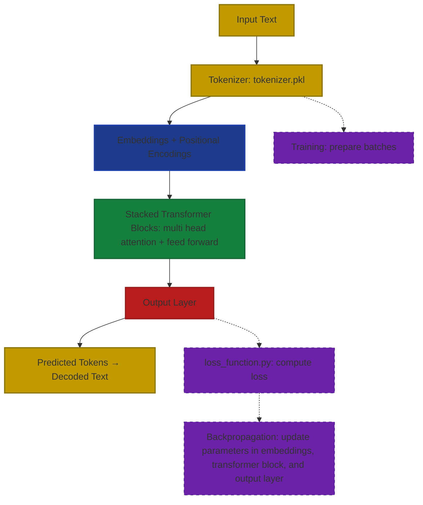

<p align="center">
  
  
  
  
</p>


# PyGPT — A Learning LLM Project

## Overview
It's a GPT-like LLM that uses a relatively small wikipedia dump as a source, so you already can deduce that it probably isn't very smart. 
This is used as more of a learning experience for myself to understand the concepts of what AI is, and how an LLM is made. 

## Libraries used
- numpy
- JAX-metal (made to run on mac)
- pickle
- sys
- os
- matplotlib

## Installation and Setup (MacOS)
This program requires the use of older Python releases, most notably 3.10.x. To do this, I recommend using PyEnv. The instructions for this are given below.


```bash
git clone -b JAX-main https://github.com/Albertlungu/PyGPT.git
```

**Install pyenv on your computer and verify installation**
```bash
curl https://pyenv.run | bash
pyenv --version
```
**Install python 3.10**
```bash
pyenv install 3.10 # This will install python 3.10.19 by default
pyenv local 3.10
```

### Setup pyenv shell
```bash
pyenv init # This shows an overview of how to setup shell, but will be covered in this readme
```
Run this to add the setup code to both `~/.zshrc` and `~/.zprofile`
```bash
cat << 'EOF' >> ~/.zshrc
export PYENV_ROOT="$HOME/.pyenv"
[[ -d $PYENV_ROOT/bin ]] && export PATH="$PYENV_ROOT/bin:$PATH"
eval "$(pyenv init - zsh)"
EOF

cat << 'EOF' >> ~/.zprofile
export PYENV_ROOT="$HOME/.pyenv"
[[ -d $PYENV_ROOT/bin ]] && export PATH="$PYENV_ROOT/bin:$PATH"
eval "$(pyenv init - zsh)"
EOF
```

Use shell and verify python version
```bash
pyenv shell 3.10
python --version # This should return "Python 3.10.19"
```

Once you have verified the use of Python 3.10, you can install the requirements and dependencies in a virtual environment.
```bash
python -m venv venv # Creates a virtual environment named 'venv'
source venv/bin/activate
which python # Should return "/Users/[your_user]/[something]/PyGPT/venv/bin/python.
```

*If `which python` does not return your venv path, make sure to manually change the path to your python interpreter in your IDE*
___

**Install dependencies**
```bash
pip install -r requirements.txt
```

## Why run this on Python 3.10?
This is because jax-metal runs most reliably on the following versions, allowing the program to take full advantage of the Apple M-series METAl-based GPUs:
```python
jax-metal==0.1.1
jax==0.5.0 
jaxlib==0.5.0
```

Without GPU usage, JAX would be forced to run on CPU, which, although fast, is greatly overshadowed by a GPU's ability to compute mathematical relationships in parallel.

## Data used in tokenizer and model

The data that I have decided to use to train both this model and the tokenizer it uses comes from the HuggingFace database. It is the Dolly-15k dataset, since it offers both good instruction-response format, as well as a strong foundation for general knowledge.

The training data file is not directly included in the GitHub repo due to size issues. The dataset setup takes around 20s. 

After installing `requirements.txt`, run `src/main/data_loader.py` with:
```bash
cd PyGPT # Make sure you are in the root directory.
python src/main/data_loader.py # Does not require "python3" since we are on Python 3.10.19
```

Remember, the tokenizer is trained on the specific Dolly-15k dataset. If you would like to use a different dataset, follow the tokenizer guide below. 

For your own ease of use, I have included `src/utils/generate_synthetic_math_latex.py`, which can be used to make a dataset for understanding and interpreting math and LaTeX syntax. This, mixed with other databases from HuggingFace, can result in a specialized model.

## How to train tokenizer on your own dataset
To train the tokenizer on your own dataset, you first want to make sure it is cleaned of "Instructions", or "Responses", or anything of the sort. This is so that the model doesn't get confused by that noise. 

Before training, load your dataset into a .txt file, and take a look at the format. If it has any of these labels, follow the code for the labels already covered in `clean_text` (lines 281 to 307):

```python
def clean_text(file_path):
    """
    Read dataset and strip out labels.
    Returns clean text with only the actual content.
    """
    clean_text = []

    with open(file_path, "r", encoding="utf-8") as f:
        for line in f:
            line = line.strip()
            # Remove the labels
            if line.startswith("Instruction:"):
                line = line.replace("Instruction:", "").strip()
            elif line.startswith("Input:"):
                line = line.replace("Input:", "").strip()
            elif line.startswith("Output:"):
                line = line.replace("Output:", "").strip()
            elif line.startswith("Response:"):
                line = line.replace("Response:", "").strip()
            elif line.startswith("Context:"):
                line = line.replace("Context:", "").strip()

            # Keep the line if it has content
            if line:
                clean_text.append(line)

    return " ".join(clean_text)
```

To make your own "flag" simply copy paste this block:
```python
elif line.startswith("Input:"):
  line = line.replace("Input:", "").strip()
```
And replace `"Input"` with the label that you would like to flag, both in the `elif` statement and in the `.replace()` parameter. The rest stays the same.

**Next**, you run the `main()` function to actually tokenize.

**Finally**, you have to run the `tokenize_training_data(path)` function to pre-tokenize the your training data. This is so that the model doesn't have to do this itself during training, which will save some time. 

>_Side note_, expect training data to take a while, especially with a large dataset. Currently, The device used is an M4 MacBook Air, and for a vocab size of 32k and a training sample of 145k lines, it is taking ~5hrs.

## Tokenizer Details
- Implements **Byte Pair Encoding (BPE)** algorithm to compress all words into subword tokens.
- Starts with a base vocab size of 256
- Iteratively merges the most frequent adjacent byte pairs (letter or character pairs) until max vocab size is reached

To learn more about BPE, I highly recommend [this video by Andrej Karpathy](https://www.youtube.com/watch?v=zduSFxRajkE) 
- **MASSIVE** thanks to him for his amazing instructional videos.

#### Example Usage:
```python
with open("artifacts/tokenizer.pkl", "rb") as f:
  tokenizer = pickle.load(f)
  tokenizer._ensure_vocab()

text = "hello world"
token_ids = tokenizer.encode(text)
print(token_ids)  # e.g., [104, 101, 108, 108, 111, 32, 119, 111, 114, 108, 100]

decoded_text = tokenizer.decode(token_ids)
print(decoded_text)  # "hello world"
```

#### Example of how it works (from [Wikipedia.org](https://en.wikipedia.org/wiki/Byte-pair_encoding#:~:text=The%20original%20BPE%20algorithm%20operates,the%20target%20text%20effectively%20compressed)):

Suppose the data to be encoded is:
```
aaabdaaabac
```
  The byte pair "aa" occurs most often, so it will be replaced by a byte that is not used in the data, such as "Z". Now there is the following data and replacement table:

```
ZabdZabac
Z=aa
```
  Then the process is repeated with byte pair "ab", replacing it with "Y":

```
ZYdZYac
Y=ab
Z=aa
```
  The only literal byte pair left occurs only once, and the encoding might stop here. Alternatively, the process could continue with recursive byte-pair encoding, replacing "ZY" with "X":

```
XdXac
X=ZY
Y=ab
Z=aa
```
  This data cannot be compressed further by byte-pair encoding because there are no pairs of bytes that occur more than once.

To decompress the data, simply perform the replacements in the reverse order.

**Source**: [Wikipedia](https://en.wikipedia.org/wiki/Byte-pair_encoding#:~:text=The%20original%20BPE%20algorithm%20operates,the%20target%20text%20effectively%20compressed)


## Embeddings
My file for the embeddings can be found in `src/embeddings/embeddings.py`. I have a more comprehensive markdown file on how my embeddings work, so you can check that out at `concepts/positional_encoding.md`. However, this section will give a *higher level* overview on embeddings in general and positional encoding.

### What are embeddings?
___
In simple terms, embeddings are vector quantities that are attributed to each token id, giving every single token a numerical representation. We have to represent tokens and words in the english language through numbers because that's what computers understand. 
>For example, if I tell a normal computer, in plain english: "Eating is the action of putting (food) into the mouth and chewing and swallowing it," the computer will just yell at me for using incorrect syntax. If I tell it: "`eating = [0.01, -1.02, -3.5e-4, ..., 6e7, -9e-2]`, it will understand!

### But how does my code do it?
___

In my `__init__` method of `embeddings.py`, the most relevant attribute there is the following:
```python
self.key = jax.random.PRNGKey(0)
self.embeddings = jax.random.normal(self.key, (self.vocab_size, self.embedding_dim)) * jnp.sqrt(1.0/self.vocab_size)
```

Here, `key` is effectively JAX's overly complicated way to do NumPy's `np.random.randn`. It creates a random floating point number.
In the next line, I declare embeddings as being a random selection of floating point numbers. The reason I do this is so that my model has a starting point. It does not start with the training and then make the embeddings from there, but the opposite. 
- First, I generate a matrix (called embedding matrix) of shape (vocab_size, embedding_dim) full of embeddings. Each of my embeddings contain `embedding_dim` numbers inside of them. 
> For example, if I have `embedding_dim = 256` and `vocab_size = 32000`, I would have 32000 embeddings, each with 256 random numbers inside of it.
> 
For the next step, we have to understand batching, and how it works. 

_To note:_ a batch is a collection of sequences, used to make training faster and more efficient
A single batch of token IDs has a shape of `(batch_size, sequence_length a.k.a max_seq_len)`
> For example, if I have a batch size of 8, and a maximum sequence length of 512, my batch would have 8 sequences of 512 token IDs.
- Next, I feed this into my embedding matrix, and I look for the specific embedding of a token ID. This works because the embedding of a token of number "x" is simply the embedding at index "x", meaning:
```python
embedded = embeddings[token_ids]
```
- After I do this, I replace each token ID with its vector from the embedding matrix. This means that that specific token ID is no longer a simple number, such as "6741", but is now a vector quantity, such as `[0.01, -1.02, -3.5e-4, ..., 6e7, -9e-2]`
  - This produces a shape of (batch_size, max_seq_len, embedding_dim)
  - > Meaning: if I have the same parameters as before, my batch after embedding lookup would have 8 sequences of 512 tokens, where each token is represented by 256 numbers.

- Once that is done, I move on to the paddings. A padding token is a specific token ID that I choose, which is most often simply token 0. `pad_token_id = 0`. Padding tokens appear when sequences are different lengths, so that the batch is nice and rectangular. These tokens are then ignored by the model through an attention mask.
- > For example, if I had a sequence saying "I like to eat food", and another that said, "But I should really look into slimming down", and a third saying "But I love food too much, I cannot commit such a crime", assume the third string to have `seq_len=256`, the second string to have `seq_len=232` (just a random number, it doesn't matter), and the first string is of `seq_len=167` (again, random number). My model likes it when these sequences are all the same length, so that it doesn't put more weight and emphasis onto the longer one. So, what you do, is you add a bunch of padding ids to the shorter ones (assume `max_seq_len=256`) to make them 256 numbers.
- Finally, we move on to the "End of Sequence" id (EOS for short). This, unlike the padding id, should not be ignored by my model. The EOS token, while masked as to not affect weights and actual output, tells my model that the sequence is over, so it knows when a line ends, or when a sentence ends. The EOS token is usually set to the vocab size
  *- This is applied later in the transformer*


## How PyGPT Works




## Project status
- [x] Tokenizer
- [x] Embedding Layer + Positional Encodings
- [x] Feed Forward Layer
- [x] Attention module (single head)
- [x] Transformer Block
- [x] Output Layer
- [x] Loss Function
- [x] Training
- [x] Use JAX to use GPU for faster processing times - create different branch in git
- [x] Multi-head attention
- [x] Stack transformer blocks
- [ ] **MAYBE**: Change tokenizer from BPE to WordPiece or SentencePiece
- [x] Optimization (optional)
- [ ] Add readme files for each part of the model for understanding
- [ ] React + Next.js + Tailwind CSS Frontend
