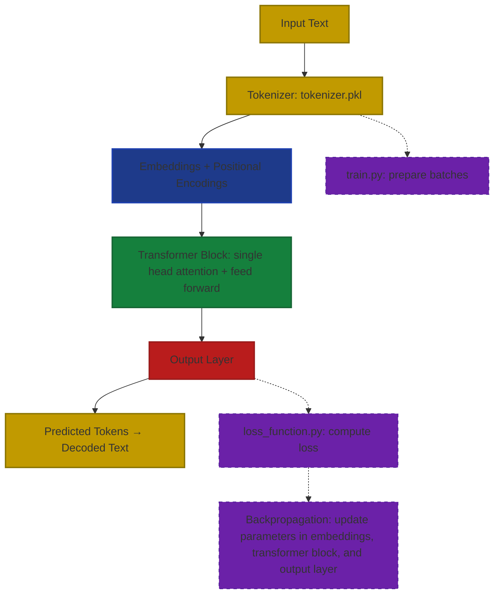

<p align="center">
  
  
  
  
</p>


# PyGPT — A Learning LLM Project

## Overview
It's a GPT-like LLM that uses a relatively small wikipedia dump as a source, so you already can deduce that it probably isn't very smart. 
This is used as more of a learning experience for myself to understand the concepts of what AI is, and how an LLM is made. 

## Libraries used
- numpy
- JAX-metal (made to run on mac)
- pickle
- sys
- os
- matplotlib

## Installation and Setup (MacOS)
This program requires the use of older Python releases, most notably 3.10.x. To do this, I recommend using PyEnv. The instructions for this are given below.


```bash
git clone -b JAX-main https://github.com/Albertlungu/PyGPT.git
```

**Install pyenv on your computer and verify installation**
```bash
curl https://pyenv.run | bash
pyenv --version
```
**Install python 3.10**
```bash
pyenv install 3.10 # This will install python 3.10.19 by default
pyenv local 3.10
```

### Setup pyenv shell
```bash
pyenv init # This shows an overview of how to setup shell, but will be covered in this readme
```
Run this to add the setup code to both `~/.zshrc` and `~/.zprofile`
```bash
cat << 'EOF' >> ~/.zshrc
export PYENV_ROOT="$HOME/.pyenv"
[[ -d $PYENV_ROOT/bin ]] && export PATH="$PYENV_ROOT/bin:$PATH"
eval "$(pyenv init - zsh)"
EOF

cat << 'EOF' >> ~/.zprofile
export PYENV_ROOT="$HOME/.pyenv"
[[ -d $PYENV_ROOT/bin ]] && export PATH="$PYENV_ROOT/bin:$PATH"
eval "$(pyenv init - zsh)"
EOF
```

Use shell and verify python version
```bash
pyenv shell 3.10
python --version # This should return "Python 3.10.19"
```

Once you have verified the use of Python 3.10, you can install the requirements and dependencies in a virtual environment.
```bash
python -m venv venv # Creates a virtual environment named 'venv'
source venv/bin/activate
which python # Should return "/Users/[your_user]/[something]/PyGPT/venv/bin/python.
```

*If `which python` does not return your venv path, make sure to manually change the path to your python interpreter in your IDE*

**Install dependencies**
```bash
pip install -r requirements.txt
```

## Why run this on Python 3.10?
This is because jax-metal runs most reliably on the following versions, allowing the program to take full advantage of the Apple M-series METAl-based GPUs:
```python
jax-metal==0.1.1
jax==0.5.0 
jaxlib==0.5.0
```

Without GPU usage, JAX would be forced to run on CPU, which, although fast, is greatly overshadowed by a GPU's ability to compute mathematical relationships in parallel.

## Data used in tokenizer and model
The data that I have decided to use to train both this model and the tokenizer it uses comes from the HuggingFace database. It is the Dolly-15k dataset, since it offers 


## Tokenizer Details
- Implements **Byte Pair Encoding (BPE)** algorithm to compress all words into subword tokens.
- Starts with a base vocab size of 256
- Iteratively merges the most frequent adjacent byte pairs (letter or character pairs) until max vocab size is reached

To learn more about BPE, I highly recommend [this video by Andrej Karpathy](https://www.youtube.com/watch?v=zduSFxRajkE) 
- **MASSIVE** thanks to him for his amazing instructional videos.

#### Example Usage:
```python
with open("artifacts/tokenizer.pkl", "rb") as f:
  tokenizer = pickle.load(f)
  tokenizer._ensure_vocab()

text = "hello world"
token_ids = tokenizer.encode(text)
print(token_ids)  # e.g., [104, 101, 108, 108, 111, 32, 119, 111, 114, 108, 100]

decoded_text = tokenizer.decode(token_ids)
print(decoded_text)  # "hello world"
```

#### Example of how it works (from [Wikipedia.org](https://en.wikipedia.org/wiki/Byte-pair_encoding#:~:text=The%20original%20BPE%20algorithm%20operates,the%20target%20text%20effectively%20compressed)):

Suppose the data to be encoded is:
```
aaabdaaabac
```
  The byte pair "aa" occurs most often, so it will be replaced by a byte that is not used in the data, such as "Z". Now there is the following data and replacement table:

```
ZabdZabac
Z=aa
```
  Then the process is repeated with byte pair "ab", replacing it with "Y":

```
ZYdZYac
Y=ab
Z=aa
```
  The only literal byte pair left occurs only once, and the encoding might stop here. Alternatively, the process could continue with recursive byte-pair encoding, replacing "ZY" with "X":

```
XdXac
X=ZY
Y=ab
Z=aa
```
  This data cannot be compressed further by byte-pair encoding because there are no pairs of bytes that occur more than once.

To decompress the data, simply perform the replacements in the reverse order.

**Source**: [Wikipedia](https://en.wikipedia.org/wiki/Byte-pair_encoding#:~:text=The%20original%20BPE%20algorithm%20operates,the%20target%20text%20effectively%20compressed)


## How PyGPT Works




## Project status
- [x] Tokenizer
- [x] Embedding Layer + Positional Encodings
- [x] Feed Forward Layer
- [x] Attention module (single head)
- [x] Transformer Block
- [x] Output Layer
- [x] Loss Function
- [x] Training
- [ ] Use JAX to use GPU for faster processing times - create different branch in git
- [ ] Multi-head attention
- [ ] Stack transformer blocks
- [ ] **MAYBE**: Change tokenizer from BPE to WordPiece or SentencePiece
- [ ] Optimization (optional)
- [ ] Add readme files for each part of the model for understanding
- [ ] React + Next.js + Tailwind CSS Frontend


O(n) = 1.1 × 10⁷ × max_lines# trigger cache refresh
